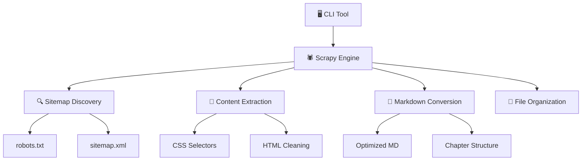

# 🤖 Aimdoc

> **Smart Documentation Scraper for AI Development**  
> Transform any documentation site into AI-ready Markdown files for enhanced coding with LLMs

[](https://opensource.org/licenses/MIT)
[](https://www.python.org/downloads/)
[](https://python.org/)

---

## 🎯 **Why Aimdoc?**

When coding with **Cursor**, **Claude**, or any LLM, you want the most up-to-date documentation at your fingertips. Instead of letting your AI assistant fetch outdated information from the web, **Aimdoc** gives you:

✨ **Fresh, local documentation** that your LLM can reference instantly  
🚀 **Optimized Markdown** designed specifically for AI consumption  
🎯 **Smart content extraction** that focuses on what matters for developers  
📁 **Organized file structure** that makes sense to both humans and AI

## 🛠️ **How It Works**

Aimdoc is a **pure Python CLI tool** that runs completely locally - no server required!

### 🕷️ **Scrapy-Powered Engine**

- **Intelligent sitemap discovery** - Automatically finds and parses sitemaps
- **Smart content extraction** - Uses universal CSS selectors to grab the right content
- **Chapter organization** - Automatically structures docs into logical sections
- **Robust error handling** - Handles failed pages gracefully with detailed diagnostics

### ⚡ **Beautiful CLI Interface**

- **Interactive setup** - Just run `aimdoc scrape` and follow the prompts
- **Live progress tracking** with elegant progress bars and spinners powered by Rich
- **Smart defaults** - Automatically detects project names and creates organized folders
- **100% local execution** - No API server, no network dependencies beyond scraping

---

## 🚀 **Quick Start**

### Prerequisites

- **Python 3.8+** with pip
- Basic familiarity with command line

### 1. Install Aimdoc

```bash
# Install directly from PyPI (when published)
pip install aimdoc

# Or install from source
git clone https://github.com/clemeverger/aimdoc.git
cd aimdoc
pip install -e .
```

### 2. Scrape Your First Documentation

```bash
# Interactive mode - just follow the prompts!
aimdoc scrape

# Or specify everything upfront
aimdoc scrape https://docs.example.com --name "Example Docs" --output-dir ./my-docs
```

That's it! Your documentation will be downloaded as clean, AI-ready Markdown files. **No server setup required!**

---

## 📖 **Usage Examples**

### Scrape Popular Documentation Sites

```bash
# Next.js documentation
aimdoc scrape https://nextjs.org/docs

# React documentation
aimdoc scrape https://react.dev

# Tailwind CSS docs
aimdoc scrape https://tailwindcss.com/docs

# FastAPI documentation
aimdoc scrape https://fastapi.tiangolo.com
```

### Advanced Usage

```bash
# Custom project name and output directory
aimdoc scrape https://docs.python.org --name "Python Official" --output-dir ./references

# See all available commands
aimdoc --help

# Check version
aimdoc version
```

---

## 🏗️ **Architecture**



### Key Components

- **🕷️ AimdocSpider**: Intelligent web crawler with sitemap discovery
- **📝 Markdown Pipeline**: Converts HTML to clean, LLM-optimized Markdown
- **📊 Progress Tracker**: Real-time CLI progress with Rich UI components
- **⚡ CLI Interface**: Beautiful command-line experience with Typer

---

## 🎨 **Features**

### 🤖 **AI-Optimized Output**

- **Clean Markdown**: Removes navigation, ads, and irrelevant content
- **Consistent formatting**: Standardized headings, code blocks, and links
- **Logical structure**: Organized into chapters and sections
- **README generation**: Auto-creates navigation index

### 🚀 **Performance & Reliability**

- **Concurrent scraping**: Process multiple pages simultaneously
- **Intelligent throttling**: Respects rate limits and robots.txt
- **HTTP caching**: Avoids re-downloading unchanged content
- **Error recovery**: Continues scraping even when some pages fail

### 🎯 **Developer Experience**

- **Interactive CLI**: No need to memorize commands or flags
- **Real-time feedback**: Beautiful progress bars and spinners with Rich
- **Smart defaults**: Works great out of the box
- **Local execution**: No server setup or management required

### 🌐 **Universal Compatibility**

- **Framework agnostic**: Works with any documentation site
- **Sitemap discovery**: Automatically finds all documentation pages
- **Flexible selectors**: Adapts to different site structures
- **Robust parsing**: Handles various HTML layouts

---

## 📁 **Project Structure**

```
aimdoc/
├── 🤖 aimdoc/                 # Main Python package
│   ├── __main__.py            # CLI entry point
│   ├── cli/                   # CLI components
│   │   ├── commands.py        # Main commands (scrape, version)
│   │   ├── progress.py        # Rich-based progress tracking
│   │   └── utils.py           # CLI utilities
│   ├── spiders/
│   │   └── aimdoc.py          # Scrapy spider with smart discovery
│   ├── pipelines/
│   │   ├── optimized_html_markdown.py  # HTML → Markdown conversion
│   │   ├── progress_tracker.py         # Progress tracking pipeline
│   │   └── assemble.py                 # File organization
│   ├── settings.py            # Scrapy configuration
│   └── items.py              # Scrapy items
├── setup.py                   # Package installation
├── requirements.txt           # Dependencies
└── README.md                  # This file
```

---

## 🔧 **Configuration**

### Custom Scrapy Settings

You can customize the scraping behavior by modifying `aimdoc/settings.py`:

```python
# Increase concurrency for faster scraping
CONCURRENT_REQUESTS = 8
CONCURRENT_REQUESTS_PER_DOMAIN = 4

# Adjust delays
DOWNLOAD_DELAY = 0.25
AUTOTHROTTLE_START_DELAY = 0.5

# Enable more verbose logging
LOG_LEVEL = 'INFO'
```

### CLI Options

```bash
# Run with custom output directory
aimdoc scrape https://docs.example.com --output-dir ~/Documentation

# Specify project name explicitly
aimdoc scrape https://docs.example.com --name "My Project Docs"

# Combine options
aimdoc scrape https://docs.example.com --name "Docs" --output-dir ./references
```

---

## 🤝 **Contributing**

We love contributions! Here's how to get started:

### Development Setup

```bash
# Fork and clone the repo
git clone https://github.com/clemeverger/aimdoc.git
cd aimdoc

# Install in development mode
pip install -e .

# Test the CLI
aimdoc version
aimdoc scrape --help
```

### Running Tests

```bash
# Test with a simple documentation site
aimdoc scrape https://typer.tiangolo.com --name "Test" --output-dir ./test-output

# Run with verbose logging to debug issues
# Edit aimdoc/settings.py and set LOG_LEVEL = 'DEBUG'
```

### Code Style

- Python: Follow PEP 8, use `black` for formatting
- Commit messages: Use conventional commits format
- Test your changes with real documentation sites before submitting

---

## 🐛 **Troubleshooting**

### Common Issues

**❌ "No sitemap found" or "NO URLS FOUND TO SCRAPE"**

```bash
# Some sites don't have sitemaps - this is normal behavior
# The scraper attempts multiple discovery methods automatically
# Check the logs for more details about what URLs were tried
```

**❌ "Permission denied"**

```bash
# Make sure you have write permissions to the output directory
chmod +w ./docs

# Or choose a different output directory you own
aimdoc scrape https://docs.example.com --output-dir ~/Documents/docs
```

**❌ "Command not found: aimdoc"**

```bash
# Make sure you installed the package correctly
pip install -e .

# Or run directly with Python
python -m aimdoc --help
```

### Getting Help

- 🐛 [Report bugs](https://github.com/clemeverger/aimdoc/issues)
- 💡 [Request features](https://github.com/clemeverger/aimdoc/issues)
- 📖 Check the source code for more details

---

## 📋 **Roadmap**

- [ ] **Enhanced site discovery** - better URL detection algorithms
- [ ] **Plugin system** for custom content extractors
- [ ] **Multiple output formats** (JSON, YAML, etc.)
- [ ] **Incremental updates** - only scrape changed pages
- [ ] **Batch processing** for multiple documentation sites
- [ ] **Integration with AI coding assistants** (direct Claude/Cursor plugins)

---

## 📄 **License**

This project is licensed under the MIT License - see the [LICENSE](LICENSE) file for details.

---

## 🙏 **Acknowledgments**

- **Scrapy** - The powerful and flexible web scraping framework that powers our engine
- **Rich** - Beautiful terminal formatting and progress bars for the CLI experience
- **Typer** - Modern Python CLI framework for building the command interface
- **Beautiful Soup & Markdownify** - HTML parsing and Markdown conversion libraries

---

<div align="center">

**Made with ❤️ for the AI development community**

[⭐ Star this repo](https://github.com/clemeverger/aimdoc) • [🐛 Report Bug](https://github.com/clemeverger/aimdoc/issues) • [💡 Request Feature](https://github.com/clemeverger/aimdoc/issues)

</div>
