# 🤖 Aimdoc

> **Smart Documentation Scraper for AI Development**  
> Transform any documentation site into AI-ready Markdown files for enhanced coding with LLMs

[](https://opensource.org/licenses/MIT)
[](https://www.python.org/downloads/)
[](https://nodejs.org/)

---

## 🎯 **Why Aimdoc?**

When coding with **Cursor**, **Claude**, or any LLM, you want the most up-to-date documentation at your fingertips. Instead of letting your AI assistant fetch outdated information from the web, **Aimdoc** gives you:

✨ **Fresh, local documentation** that your LLM can reference instantly  
🚀 **Optimized Markdown** designed specifically for AI consumption  
🎯 **Smart content extraction** that focuses on what matters for developers  
📁 **Organized file structure** that makes sense to both humans and AI

## 🛠️ **How It Works**

Aimdoc is a complete documentation scraping solution with three components:

### 🕷️ **Scrapy-Powered Engine**

- **Intelligent sitemap discovery** - Automatically finds and parses sitemaps
- **Smart content extraction** - Uses universal CSS selectors to grab the right content
- **Chapter organization** - Automatically structures docs into logical sections
- **Robust error handling** - Handles failed pages gracefully with detailed diagnostics

### 🖥️ **REST API Server**

- **Real-time job tracking** with WebSocket support
- **Concurrent job processing** for multiple documentation sites
- **File download endpoints** for easy access to results
- **Built with FastAPI** for high performance and automatic API docs

### ⚡ **Beautiful CLI**

- **Interactive setup** - Just run `aimdoc scrape` and follow the prompts
- **Live progress tracking** with elegant progress bars and spinners
- **Smart defaults** - Automatically detects project names and creates organized folders
- **Comprehensive diagnostics** - Debug failed scrapes with detailed error reports

---

## 🚀 **Quick Start**

### Prerequisites

- **Python 3.8+** with pip
- **Node.js 16+** with npm/pnpm
- Basic familiarity with command line

### 1. Install the API Server

```bash
# Clone the repository
git clone https://github.com/clemeverger/aimdoc.git
cd aimdoc

# Install Python dependencies
pip install -r requirements.txt

# Start the API server
python start_api.py
```

### 2. Install the CLI

```bash
# Install the CLI globally
cd cli
npm install -g .

# Or use pnpm
pnpm install -g .
```

### 3. Scrape Your First Documentation

```bash
# Interactive mode - just follow the prompts!
aimdoc scrape

# Or specify everything upfront
aimdoc scrape https://docs.example.com -n "Example Docs" -o ./my-docs
```

That's it! Your documentation will be downloaded as clean, AI-ready Markdown files.

---

## 📖 **Usage Examples**

### Scrape Popular Documentation Sites

```bash
# Next.js documentation
aimdoc scrape https://nextjs.org/docs

# React documentation
aimdoc scrape https://react.dev

# Tailwind CSS docs
aimdoc scrape https://tailwindcss.com/docs

# FastAPI documentation
aimdoc scrape https://fastapi.tiangolo.com
```

### Advanced Usage

```bash
# Custom project name and output directory
aimdoc scrape https://docs.python.org --name "Python Official" --output-dir ./references

# Check job status
aimdoc jobs

# Download results from a previous job
aimdoc download <job-id>

# Diagnose failed scrapes
aimdoc diagnose <job-id> --verbose
```

---

## 🏗️ **Architecture**

```mermaid
graph TB
    CLI[🖥️ CLI Tool] --> API[🔌 FastAPI Server]
    API --> Engine[🕷️ Scrapy Engine]

    Engine --> Discover[🔍 Sitemap Discovery]
    Engine --> Extract[📄 Content Extraction]
    Engine --> Convert[📝 Markdown Conversion]
    Engine --> Organize[📁 File Organization]

    Discover --> Robots[robots.txt]
    Discover --> Sitemap[sitemap.xml]

    Extract --> CSS[CSS Selectors]
    Extract --> Clean[HTML Cleaning]

    Convert --> Markdown[Optimized MD]
    Convert --> Structure[Chapter Structure]
```



### Key Components

- **🕷️ AimdocSpider**: Intelligent web crawler with sitemap discovery
- **📝 Markdown Pipeline**: Converts HTML to clean, LLM-optimized Markdown
- **📊 Progress Tracker**: Real-time updates via WebSocket
- **🔧 Job Service**: Manages concurrent scraping jobs
- **⚡ CLI Interface**: Beautiful command-line experience

---

## 🎨 **Features**

### 🤖 **AI-Optimized Output**

- **Clean Markdown**: Removes navigation, ads, and irrelevant content
- **Consistent formatting**: Standardized headings, code blocks, and links
- **Logical structure**: Organized into chapters and sections
- **README generation**: Auto-creates navigation index

### 🚀 **Performance & Reliability**

- **Concurrent scraping**: Process multiple pages simultaneously
- **Intelligent throttling**: Respects rate limits and robots.txt
- **HTTP caching**: Avoids re-downloading unchanged content
- **Error recovery**: Continues scraping even when some pages fail

### 🎯 **Developer Experience**

- **Interactive CLI**: No need to memorize commands or flags
- **Real-time feedback**: See progress as it happens
- **Detailed diagnostics**: Understand exactly what went wrong
- **Smart defaults**: Works great out of the box

### 🌐 **Universal Compatibility**

- **Framework agnostic**: Works with any documentation site
- **Sitemap discovery**: Automatically finds all documentation pages
- **Flexible selectors**: Adapts to different site structures
- **Robust parsing**: Handles various HTML layouts

---

## 📁 **Project Structure**

```
aimdoc/
├── 🕷️ aimdoc/                 # Scrapy spider and pipelines
│   ├── spiders/
│   │   └── aimdoc.py          # Main spider with smart discovery
│   ├── pipelines/
│   │   ├── optimized_html_markdown.py  # HTML → Markdown conversion
│   │   ├── progress_tracker.py         # Real-time progress updates
│   │   └── assemble.py                 # File organization
│   └── settings.py            # Scrapy configuration
├── 🔌 api/                    # FastAPI server
│   ├── main.py               # API application
│   ├── routers/
│   │   └── jobs.py           # Job management endpoints
│   └── services/
│       └── job_service.py    # Core job processing logic
├── ⚡ cli/                    # Command-line interface
│   ├── src/
│   │   ├── commands/         # CLI commands (scrape, diagnose, etc.)
│   │   ├── api.ts           # API client
│   │   └── utils.ts         # Helper utilities
│   └── package.json
└── 📄 docs/                  # Example scraped documentation
```

---

## 🔧 **Configuration**

### Environment Variables

```bash
# API Server (optional)
AIMDOC_API_URL=http://localhost:8000    # API server URL
AIMDOC_JOBS_DIR=./jobs                  # Job storage directory

# Scraping (optional)
SCRAPY_SETTINGS_MODULE=aimdoc.settings  # Custom Scrapy settings
```

### Custom Scrapy Settings

You can customize the scraping behavior by modifying `aimdoc/settings.py`:

```python
# Increase concurrency for faster scraping
CONCURRENT_REQUESTS = 32
CONCURRENT_REQUESTS_PER_DOMAIN = 16

# Adjust delays
DOWNLOAD_DELAY = 0.1
AUTOTHROTTLE_START_DELAY = 0.25
```

---

## 🤝 **Contributing**

We love contributions! Here's how to get started:

### Development Setup

```bash
# Fork and clone the repo
git clone https://github.com/clemeverger/aimdoc.git
cd aimdoc

# Install Python dependencies
pip install -r requirements.txt

# Install CLI dependencies
cd cli && npm install

# Start the API server in development mode
python start_api.py

# In another terminal, test the CLI
cd cli && npm run dev
```

### Running Tests

```bash
# Python tests
python -m pytest

# CLI tests
cd cli && npm test
```

### Code Style

- Python: Follow PEP 8, use `black` for formatting
- TypeScript: Use Prettier and ESLint configurations
- Commit messages: Use conventional commits format

---

## 🐛 **Troubleshooting**

### Common Issues

**❌ "No sitemap found"**

```bash
# Some sites don't have sitemaps - this is expected
# The scraper will attempt fallback discovery methods
aimdoc diagnose <job-id> --verbose
```

**❌ "Connection refused"**

```bash
# Make sure the API server is running
python start_api.py

# Check if port 8000 is available
lsof -i :8000
```

**❌ "Permission denied"**

```bash
# Make sure you have write permissions to the output directory
chmod +w ./docs
```

### Getting Help

- 📖 Check the [CLI documentation](./cli/README.md)
- 🐛 [Report bugs](https://github.com/clemeverger/aimdoc/issues)

---

## 📋 **Roadmap**

- [ ] **Plugin system** for custom content extractors
- [ ] **Incremental updates** - only scrape changed pages
- [ ] **Multiple output formats** (JSON, YAML, etc.)
- [ ] **Cloud deployment** templates (Docker, Kubernetes)
- [ ] **Integration guides** for popular AI coding assistants
- [ ] **Batch processing** for multiple documentation sites

---

## 📄 **License**

This project is licensed under the MIT License - see the [LICENSE](LICENSE) file for details.

---

## 🙏 **Acknowledgments**

- **Scrapy** - The powerful and flexible web scraping framework
- **FastAPI** - Modern, fast web framework for building APIs
- **Commander.js** - The complete solution for Node.js command-line programs
- **Inquirer.js** - Beautiful interactive command line user interfaces

---

<div align="center">

**Made with ❤️ for the AI development community**

[⭐ Star this repo](https://github.com/clemeverger/aimdoc) • [🐛 Report Bug](https://github.com/clemeverger/aimdoc/issues) • [💡 Request Feature](https://github.com/clemeverger/aimdoc/issues)

</div>
